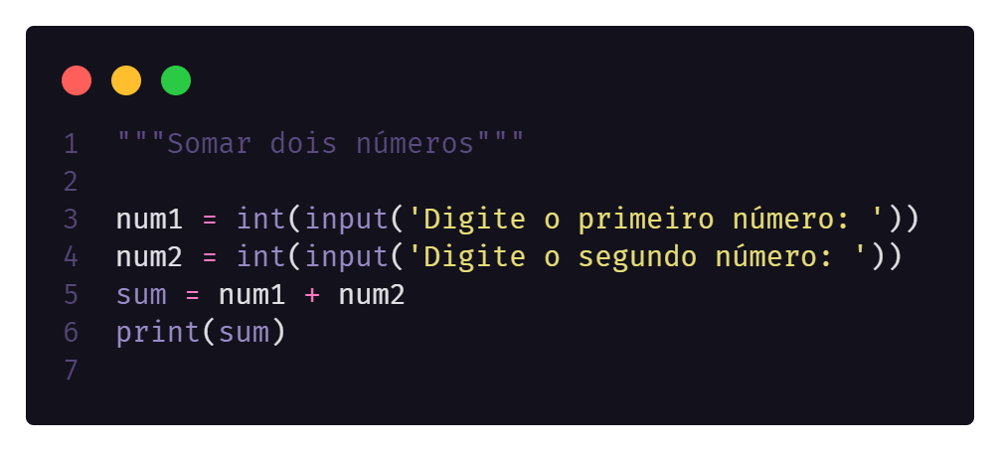

# Learning Python 
          

Este repositório foi criado com o intuito de documentar todo o meu aprendizado em python, para aprender essa linguagem estou utilizando como material de estudo os cursos da plataforma [Curso em Vídeo](https://cursoemvideo.com).

## Demonstração

Na primeira linha de cada script terá um comentário descrevendo o exercício proposto e nas linhas seguintes estarão os códigos da sua resolução, como podemos observar no exemplo abaixo.

## Licença

[MIT](https://choosealicense.com/licenses/mit/)
